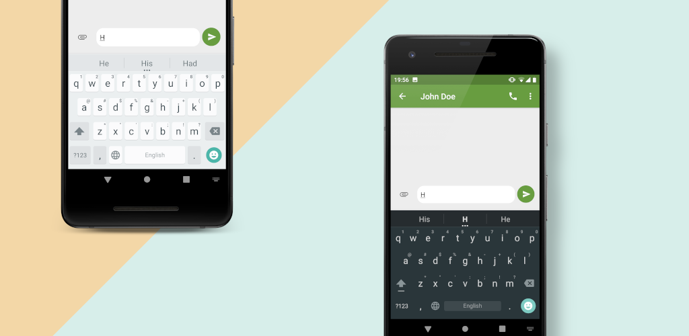

# OpenBoard

[](https://github.com/openboard-team/openboard/actions/workflows/android-build.yml)
[](https://github.com/openboard-team/openboard/releases)
[](https://github.com/openboard-team/openboard/commits/master)
[](https://hosted.weblate.org/engage/openboard/)

<a href='https://f-droid.org/packages/org.dslul.openboard.inputmethod.latin'></a>
<a href='https://play.google.com/store/apps/details?id=org.dslul.openboard.inputmethod.latin&pcampaignid=pcampaignidMKT-Other-global-all-co-prtnr-py-PartBadge-Mar2515-1'></a>



100% FOSS keyboard, based on AOSP.

## Community [matrix] channel


Join [here](https://matrix.to/#/#openboard:matrix.org?via=matrix.org)

## Common issues
- Cannot open settings in MIUI: See [issue #46](https://github.com/dslul/openboard/issues/46).

## Contribute

### Translation
You can help in translating OpenBoard in your language through our [Weblate project](https://hosted.weblate.org/engage/openboard/).
[](https://hosted.weblate.org/engage/openboard/)

### How to create a dictionary
You can use [this tool](https://github.com/remi0s/aosp-dictionary-tools) to create a dictionary. You need a wordlist, as described [here](dictionaries/sample.combined). The output .dict file must be put in [res/raw](app/src/main/res/raw).

### How to edit keyboard texts
Make your modifications in [tools/make-keyboard-text/src/main/resources](tools/make-keyboard-text/src/main/resources)/values-YOUR LOCALE.

Generate the new version of [KeyboardTextsTable.java](app/src/main/java/org/dslul/openboard/inputmethod/keyboard/internal/KeyboardTextsTable.java):
```sh
./gradlew tools:make-keyboard-text:makeText
```


### APK Development

#### Linux

Install java:
```sh
sudo pacman -S jdk11-openjdk jre11-openjdk jre11-openjdk-headless
```

Install Android SDK:
```sh
sudo pacman -S snapd
sudo snap install androidsdk
```

Configure your SDK location in your `~/.bash_profile` or `~/.bashrc`:
```bash
export ANDROID_SDK_ROOT=~/snap/androidsdk/current/AndroidSDK/
```

Compile the project. This will install all dependencies, make sure to accept
licenses when prompted.

```sh
./gradlew assembleDebug
```

Connect your phone and install the debug APK
```sh
adb install ./app/build/outputs/apk/debug/app-debug.apk
```
## Credits
- icon by [Marco TLS](https://www.marcotls.eu)

- [AOSP Keyboard](https://android.googlesource.com/platform/packages/inputmethods/LatinIME/)
- [LineageOS](https://review.lineageos.org/admin/repos/LineageOS/android_packages_inputmethods_LatinIME)
- [Simple Keyboard](https://github.com/rkkr/simple-keyboard)
- [Indic Keyboard](https://gitlab.com/indicproject/indic-keyboard)
