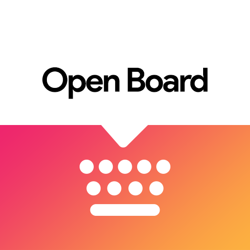

# OpenBoard upgrade, WIP

This is an attempt to integrate changes / improvements into OpenBoard that have been sitting around for a long time due to low dev activity.
Might end up on F-Droid...

**consider all releases as beta**

Changes:
* Updated dependencies
* Debug version can be installed along OpenBoard
* Allow users to add and replace built-in dictionaries
  * modified / improved from https://github.com/openboard-team/openboard/pull/569 and https://github.com/openboard-team/openboard/pull/578
  * some AOSP dictionaries are available [here](dictionaries/dict)
    * experimental dictionaries with next-word suggestions created from sentence lists [are also available](dictionaries/experimental), but they may contain unwanted words, and may be missing other features
  * dictionary files starting with "main_" replace the built-in dictionary for the language, all other names work as add-on dictionaries
  * add [Arabic dictionary](https://github.com/remi0s/aosp-dictionary-tools/blob/master/dictsCreated/WikiAndOpenSubtitles/ar_wordlist.combined) for download, from https://github.com/openboard-team/openboard/pull/450
  * add [Hebrew dictionary](https://github.com/Hananel-Hazan/aosp-dictionary-tools/blob/master/hebrew-hspell.txt.combined.new) for download, from https://github.com/openboard-team/openboard/pull/300
  * add [Galician dictionary](https://github.com/chavaone/openboard/blob/master/dictionaries/es_GL_wordlist.combined.g) for download, from https://github.com/openboard-team/openboard/pull/291
* Fix suggestions after some characters, https://github.com/openboard-team/openboard/pull/694, https://github.com/openboard-team/openboard/issues/795
* Fix suggestions sometimes not being shown, https://github.com/openboard-team/openboard/pull/709
* Reduce amount of unwanted automatic space insertions, https://github.com/openboard-team/openboard/pull/576
* Exit shift-symbol view on space (same as normal symbol view)
* Add multi-lingual typing, slightly modified from https://github.com/openboard-team/openboard/pull/586, https://github.com/openboard-team/openboard/pull/593
* Allow loading an external library to enable gesture typing, https://github.com/openboard-team/openboard/issues/3
  * based on [wordmage's work](https://github.com/openboard-team/openboard/tree/57d33791d7674e3fe0600eddb72f6b4317b5df00)
  * tested with [Google libraries](https://github.com/erkserkserks/openboard/tree/master/app/src/main/jniLibs) and [others](https://github.com/openboard-team/openboard/issues/3#issuecomment-1200456262) (when building with the [rename](https://github.com/openboard-team/openboard/tree/57d33791d7674e3fe0600eddb72f6b4317b5df00))
* Allow adjusting keyboard colors, https://github.com/openboard-team/openboard/issues/124
  * Optionally make the navigation bar follow current theme, https://github.com/Helium314/openboard/issues/4
* Remove suggestions by long pressing on suggestion strip while the more suggestions popup is open, https://github.com/openboard-team/openboard/issues/106
  * suggestions get re-added if they are entered again
* Optionally add typed words to system personal dictionary
* Allow using contacts for suggestions (enable in spell checker settings), https://github.com/openboard-team/openboard/issues/374
* Re-arranged comma-long-press-menu, https://github.com/Helium314/openboard/pull/7
* Make Bengali spell check work, https://github.com/Helium314/openboard/pull/11

Plan / to do:
* ~upgrade dependencies~
* upgrade NDK, https://github.com/openboard-team/openboard/issues/782
* maybe: rename (package, app, icon), so it can be installed parallel to OpenBoard, and published on F-Droid
* ~user-selectable dictionaries, https://github.com/openboard-team/openboard/pull/578~
  * ~make additional dictionaries available for download (from OpenBoard PRs)~
  * more dictionaries
  * ~proper icon for preference~ https://github.com/Helium314/openboard/pull/10
* ~multi-lingual typing, https://github.com/openboard-team/openboard/pull/586, https://github.com/openboard-team/openboard/pull/593~
  * maybe improve way of merging suggestions from both languages
  * test whether it works reasonably well in non-latin scripts
* ~suggestion fixes, https://github.com/openboard-team/openboard/pull/694, https://github.com/openboard-team/openboard/issues/795, https://github.com/openboard-team/openboard/issues/660~
* ~improve auto-space insertion, https://github.com/openboard-team/openboard/pull/576~
* ~emoji prediction/search, https://github.com/openboard-team/openboard/pull/749 (better use emoji dictionaries, this is more flexible)~
* ~theming, https://github.com/openboard-team/openboard/issues/124~
  * ~fix emoji view not themed properly~
  * ~fix ABC buttons in emoji and clipboard view have wrong text color~
  * fix buttons on long-press action key not themed
  * allow adjusting colors without requiring manual reload of keyboard
  * fix issues in _more suggestions_ view, https://github.com/Helium314/openboard/issues/9#issuecomment-1626932543
* ~delete suggestions, https://github.com/openboard-team/openboard/issues/106~
  * make functionality more discoverable, e.g. add a button to the _more suggestions_ menu
* ~gesture typing, https://github.com/openboard-team/openboard/issues/3~
  * ~license issues, require using an external library~
* ~move/copy _use contacts_ setting from well hidden spell checker settings to _text correction_ settings~
* add emojis to user history, to be used for next word suggestions

-----

<h1 align="center"><b>OpenBoard</b></h1>
<h4 align="center">100% FOSS keyboard, based on AOSP.</h4>
<p align="center"></p>
<p align="center">
<a href="https://github.com/openboard-team/openboard/actions/workflows/android-build.yml"></a>
<a href="https://hosted.weblate.org/engage/openboard/"></a>
<a href="https://matrix.to/#/#openboard:matrix.org?via=matrix.org"></a></p>
<p align="center">
<a href="https://github.com/openboard-team/openboard/releases"></a>
<a href="https://f-droid.org/packages/org.dslul.openboard.inputmethod.latin"></a>
<a href="https://play.google.com/store/apps/details?id=org.dslul.openboard.inputmethod.latin"></a>
<a href="https://github.com/openboard-team/openboard/releases"></a>
<a href="https://github.com/openboard-team/openboard/commits/master"></a></p>
<p align="center">
<a href='https://f-droid.org/packages/org.dslul.openboard.inputmethod.latin'></a>
<a href='https://play.google.com/store/apps/details?id=org.dslul.openboard.inputmethod.latin&pcampaignid=pcampaignidMKT-Other-global-all-co-prtnr-py-PartBadge-Mar2515-1'></a></p>  

# Table of content

- [Community](#community)
- [Contribution ❤](#contribution-)
   * [Issue reporting](#issue-reporting)
   * [Translation](#translation)
   * [Dictionary creation](#dictionary-creation)
   * [Code contribution](#code-contribution)
      + [Getting started](#getting-started)
      + [Guidelines](#guidelines)
      + [Current TODO list](#current-todo-list)
      + [Project's side tools](#tooling)
- [License](#license)
- [Credits](#credits)

# Community
Join our [matrix] channel [here](https://matrix.to/#/#openboard:matrix.org?via=matrix.org).


# Contribution ❤

## Issue reporting

Whether you encountered a bug, or want to see a new feature in OpenBoard, you can contribute to the project by opening a new issue [here](https://github.com/openboard-team/openboard/issues). Your help is always welcomed !

Before opening a new issue, be sure to check the following :
 - **Does the issue already exist ?** Make sure a similar issue has not been reported by browsing [existing issues](https://github.com/openboard-team/openboard/issues).
 - **Is the issue still relevant ?** Make sure your issue is not already fixed in the latest version of OpenBoard.
 - **Did you use the issue template ?** It is important to make life of our kind contributors easier by avoiding  issues that miss key informations to their resolution.

*Please avoid opening issues to ask for a release date, for PR reviews/merges, for more activity on the project, or worth for more contributors. If you have any interrogations on these topics, read [this comment](https://github.com/openboard-team/openboard/issues/619#issuecomment-1179534276) from issue [#619](https://github.com/openboard-team/openboard/issues/619).*

## Translation
You can help in translating OpenBoard in your language through our [Weblate project](https://hosted.weblate.org/engage/openboard/).

[](https://hosted.weblate.org/engage/openboard/)

## Dictionary creation
To create or update a dictionary for your language, you can use [this tool](https://github.com/remi0s/aosp-dictionary-tools). You will need a wordlist, as described [here](dictionaries/sample.combined). The output .dict file must be put in [res/raw](app/src/main/res/raw), and its wordlist in [dictionaries](/dictionaries).

For your dictionary to be merged into OpenBoard, **you must provide the wordlist you used**, as well as its license if any.

## Code contribution

### Getting started

OpenBoard project is based on Gradle and Android Gradle Plugin. To get started, you'll just need to install [Android Studio](https://developer.android.com/studio), and import project 'from Version Control / Git / Github' by providing this git repository [URL](https://github.com/openboard-team/openboard) (or git SSH [URL](git@github.com:openboard-team/openboard.git)).

Once everything got setted up correctly, you're ready to go !

### Guidelines

OpenBoard is a complex application, when contributing, you must take a step back and make sure your contribution :
- **Uses already in-place mechanism and take advantage of them**. In other terms, does not reinvent the wheel or uses shortcuts that could alter the consistency of the existing code.
- **Has the lowest footprint possible**. OpenBoard code has been written by android experts (AOSP/Google engineers). It has been tested and runned on millions of devices. Thus, **existing code will always be safer than new code**. The less we alter existing code, the more OpenBoard will stay stable. Especially in the input logic scope.
- **Does not bring any non-free code or proprietary binary blobs**. This also applies to code/binaries with unknown licenses. Make sure you do not introduce any closed-source library from Google.
- **Complies with the user privacy principle OpenBoard follows**. 

In addition to previous elements, OpenBoard must stick to [F-Droid inclusion guidelines](https://f-droid.org/docs/Inclusion_Policy/).

### Current TODO list
In no particular order, here is the non-exhaustive list of known wanted features :
- [x] ~~Updated emoji support~~
- [ ] MaterialYou ([M3](https://m3.material.io/)) support
- [x] ~~One-handed mode feature~~
- [ ] Android [autofill](https://developer.android.com/guide/topics/text/ime-autofill) support
- [x] ~~Clipboard history feature~~
- [ ] Text navigation/selection panel
- [ ] Multi-locale typing
- [ ] Emoji search
- [ ] Emoji variant saving
- [ ] Glide typing

### Tooling

#### Edit keyboards content
Keyboards content is often a complex concatenation of data from global to specific locales. For example, additional keys of a given key, also known as 'more keys' in code, are determined by concatenating infos from : common additional keys for a layout (eg. numbers), global locale (eg. common symbols) and specific locale (eg. accents or specific letters).

To edit these infos, you'll need to generate the [KeyboardTextsTable.java](app/src/main/java/org/dslul/openboard/inputmethod/keyboard/internal/KeyboardTextsTable.java) file. 
To do so :
1. Make your modifications in [tools/make-keyboard-text/src/main/resources](tools/make-keyboard-text/src/main/resources)/values-YOUR LOCALE.
2. Generate the new version of [KeyboardTextsTable.java](app/src/main/java/org/dslul/openboard/inputmethod/keyboard/internal/KeyboardTextsTable.java) by running Gradle task 'makeText' :
    ```sh
    ./gradlew tools:make-keyboard-text:makeText
    ```
   
#### Update emojis

See make-emoji-keys tool [README](tools/make-emoji-keys/README.md).

# License

OpenBoard project is licensed under GNU General Public License v3.0.

 > Permissions of this strong copyleft license are conditioned on making available complete source code of licensed works and modifications, which include larger works using a licensed work, under the same license. Copyright and license notices must be preserved. Contributors provide an express grant of patent rights.

See repo's [LICENSE](/LICENSE) file.

# Credits
- Icon by [Marco TLS](https://www.marcotls.eu)
- [AOSP Keyboard](https://android.googlesource.com/platform/packages/inputmethods/LatinIME/)
- [LineageOS](https://review.lineageos.org/admin/repos/LineageOS/android_packages_inputmethods_LatinIME)
- [Simple Keyboard](https://github.com/rkkr/simple-keyboard)
- [Indic Keyboard](https://gitlab.com/indicproject/indic-keyboard)
- Our [contributors](https://github.com/openboard-team/openboard/graphs/contributors)
